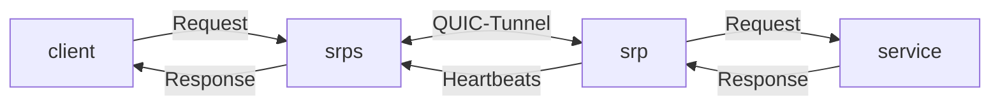

# srp

## Idea

Expose self-hosted services to the internet via an external relay (hosted on a VPS).

- Expose anything from a basic HTTP endpoint to a game severs using UDP
- Fully transparent relay server -> TLS connections only terminate at the agents
- Automatic TLS certificates
- Easy configuration and deployment via Docker or Linux binary
- Minimal resources required by relay server
- Monitor service health
- Build open source with self-hosting at heart

## Architecture

srp consists of two parts, the binary deployed on a remote server (`srps`) and the "clients" (`srp`) that connect to it. These clients are not to be confused with the clients that want to connect to one of your services, which are proxied through srp.

## Tech Stack

- Rust
- QUIC Protocol (using quinn crate)

## Deploy yourself

## Contribute

## Related projects

- https://github.com/rathole-org/rathole
- https://github.com/fosrl/pangolin
- https://github.com/fatedier/frp
